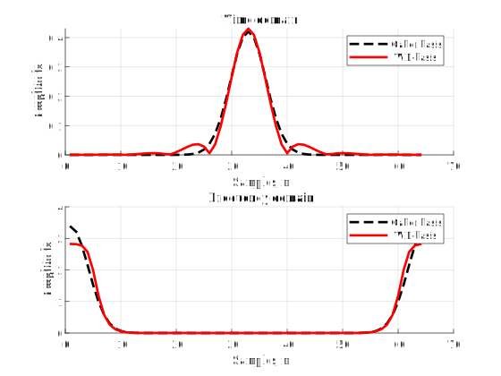

# Weyl-Heisenberg Toolbox

This MATLAB toolbox was developed to study the **Weyl-Heisenberg bases** and their properties in the field of signal processing and compression in time-frequency domain. The toolbox includes m-files that allow the synthesis and analysis of forming WH-functions and their corresponding orthogonal bases.  

# Installation
Add toolbox to your MATLAB path
```matlab  
addpath('[...] /matlab/toolbox_scripts')
addpath('[...] /matlab/toolbox_samples')
```

# Introduction
We propose a new approach to raster image compression based on the use of an orthogonal WH basis specially optimized for the task of processing real images. To do this, we construct the two-dimensional real discrete **Weyl-Heisenberg transform** (DWHT), which has the property of orthogonality and the best time-frequency localization. We show that the DWHT provides better compression characteristics than other orthogonal bases - DCT and discrete Hartley transform (DHT). Moreover, we propose an image compression algorithm based on the JPEG ideas, but focused on DWHT.  

# Othogonalization
It is well known that the gaussian function is ideally localized in the time-frequency domain. However, the Weyl-Heisenberg basis built on gaussian function (Gabor basis) is not orthogonal. However, the use of a standard orthogonalization procedure, for example, the Gram-Schmidt process, will lead to a significant deterioration in the time-frequency localization, and, as a consequence, such an orthogonal Weyl-Heisenberg basis will not be optimal. In old papers, an algorithm is proposed for constructing an Weyl-Heisenberg basis using the spectral decomposition, but it is is not computationally efficient. In modern papers, algorithms for the synthesis of the forming WH-function based on discrete Wigner and Zak transforms.  
This MATLAB toolbox includes all procedures of basis orthogonalizations. Run sample script ***wh_filter.m*** to construct bases orthogonal Weyl-Heisenberg basis using discrete Zak transform.  
```
Number of frequency shifts M = 8
Number of time shifts L = 8
Beta-parameter = 1
```
<p align="center"></p>

# Other implementations
[UMapx.NET](https://github.com/asiryan/UMapx.NET) - Digital signal processing library for .NET Core and .NET Framework. Fast and optimized.

# References
1. *D. Petrov, V. Volchkov* - Orthogonal well-localized Weyl-Heisenberg basis construction and optimization for multicarrier digital communication systems (2009).
2. *V. Volchkov, V. Sannikov* - Algebraic approach to the optimal synthesis of real signal Weyl-Heisenberg bases (2018).
3. *H. Bolcskei, F. Hlawatsch* - Discrete Zak Transforms, Polyphase Transforms, and Applications (1997).
4. *A. Vahlin* - Efficient Algorithms for Modulation and Demodulation in OFDM-Systems (2003).
5. *V. Volchkov et al.* - Synthesis of Real Weyl-Heisenberg Signal Frames with Desired Frequency-Time Localization (2019).
6. *V. Asiryan et al.* - Image Compression Using Discrete Weyl-Heisenberg Transform (2020).

# License
**Apache License v2.0**  
