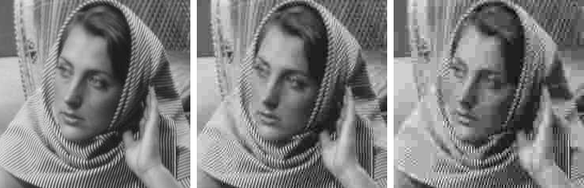

# Weyl-Heisenberg Toolbox

This MATLAB toolbox was developed to study the **Weyl-Heisenberg bases** and their properties in the field of signal processing and compression in time-frequency domain. The toolbox includes m-files that allow the synthesis and analysis of forming WH-functions and their corresponding orthogonal bases.  

# Installation
Add toolbox to your MATLAB path
```matlab  
addpath('[...] /matlab/toolbox_scripts')
addpath('[...] /matlab/toolbox_samples')
```

# Introduction
We propose a new approach to raster image compression based on the use of an orthogonal WH basis specially optimized for the task of processing real images. To do this, we construct the two-dimensional real discrete **Weyl-Heisenberg transform** (DWHT), which has the property of orthogonality and the best time-frequency localization. We show that the DWHT provides better compression characteristics than other orthogonal bases - DCT and discrete Hartley transform (DHT). Moreover, we propose an image compression algorithm based on the JPEG ideas, but focused on DWHT.  

# Orthogonalization
It is well known that the gaussian function is ideally localized in the time-frequency domain. However, the Weyl-Heisenberg basis built on gaussian function (Gabor basis) is not orthogonal. However, the use of a standard orthogonalization procedure, for example, the Gram-Schmidt process, will lead to a significant deterioration in the time-frequency localization, and, as a consequence, such an orthogonal Weyl-Heisenberg basis will not be optimal. In old papers, an algorithm is proposed for constructing an Weyl-Heisenberg basis using the eigenvalue decomposition, but it is is not computationally efficient. We present fast algorithm for the synthesis of the forming WH-function based on discrete [Zak](matlab/toolbox_scripts/dzakt.m) transform.  
This MATLAB toolbox includes all procedures of basis orthogonalizations. Run sample [script](matlab/toolbox_scripts/wh_filter.m) to construct Gabor and Weyl-Heisenberg bases.  
```
Number of frequency shifts M = 8
Number of time shifts L = 8
Beta-parameter = 1
```
<p align="center"></p>

# Construction
This toolbox provides methods to construct Weyl-Heisenberg basis and its modifications.
| Script | Orthogonal | Type | Dimension | Notation |
|-------------|-------------|-------------|-------------|--------------|
| [gabor.m](matlab/toolbox_scripts/gabor.m) | no | complex | N x 2N | Gabor basis (rectangular) |
| [gaborc.m](matlab/toolbox_scripts/gaborc.m) | no | complex | N x N | Gabor basis (square) |
| [gaborr.m](matlab/toolbox_scripts/gaborr.m) | no | real | 2N x 2N | Gabor basis (real) |
| [weylhz.m](matlab/toolbox_scripts/weylhz.m) | yes | complex | N x 2N | Weyl-Heisenberg basis (rectangular) |
| [weylhzc.m](matlab/toolbox_scripts/weylhzc.m) | yes | complex | N x N | Weyl-Heisenberg basis (square) |
| [weylhzr.m](matlab/toolbox_scripts/weylhzr.m) | yes | real | 2N x 2N | Weyl-Heisenberg basis (real) |
| [weylhzf.m](matlab/toolbox_scripts/weylhzf.m) | yes | complex | N x 2N | Weyl-Heisenberg basis (fast algorithm) |
| [weylhzg.m](matlab/toolbox_scripts/weylhzg.m) | yes | complex | N x 2N | Weyl-Heisenberg basis (Gram-Schmidt) |

# Compression
This toolbox includes a new approach to image compression based on the discrete Weyl-Heisenberg transform. Comparison of our technique and the original JPEG (DCT-based) algorithm for different values of the quantization coefficient *R* is presented below. Figures 1-2 show, as an example, the results of compressing the same image [barbara.png](matlab/toolbox_samples/Images/barbara.png) (512×512 pixels) at *R* = 1, 4, 8 using DCT (JPEG) and DWHT, and Tables 1-2 show extended numerical results.

<p align="center"></p>  
<p align="center"><b>Figure 1.</b> Compression using DCT (JPEG) for R = 1, 4, 8</p>  

<p align="center"></p>  
<p align="center"><b>Figure 2.</b> Compression using DWHT (β = 2) for R = 1, 4, 8</p>  

**Table 1.** Compression using DCT (JPEG)
| Quantization coefficient, R | 1 | 2 | 4 | 8 | 16 | 32 |
|:-----------|:-----------:|:-----------:|:-----------:|:-----------:|:-----------:|:-----------:|
| Compression coefficient, K (%) | 83.73 | 89.43 | 93.82 | 96.63 | 98.06 | 98.99 |
| PSNR (dB) | 32.53 | 29.30 | 26.26 | 23.92 | 22.01 | 19.06 |
| Quality losses, E | 438.58 | 660.72 | 980.48 | 1399.16 | 1601.70 | 3404.39 |

**Table 2.** Compression using DWHT
| Quantization coefficient, R | 1 | 2 | 4 | 8 | 16 | 32 |
|:-----------|:-----------:|:-----------:|:-----------:|:-----------:|:-----------:|:-----------:|
| Compression coefficient, K (%) | 86.18 | 91.22 | 94.62 | 96.73 | 97.94 | 98.56 |
| PSNR (dB) | 34.19 | 31.19 | 28.27 | 25.57 | 23.48 | 21.91 | 
| Quality losses, E | 326.86 | 494.31 | 737.01 | 1073.84 | 1451.38 | 1796.39 |

# Other implementations
[UMapx.NET](https://github.com/asiryan/UMapx.NET) - Digital signal processing library for .NET Core and .NET Framework. Fast and optimized.

# References
1. *D. Petrov, V. Volchkov* - Orthogonal well-localized Weyl-Heisenberg basis construction and optimization for multicarrier digital communication systems (2009).
2. *V. Volchkov, V. Sannikov* - Algebraic approach to the optimal synthesis of real signal Weyl-Heisenberg bases (2018).
3. *H. Bolcskei, F. Hlawatsch* - Discrete Zak Transforms, Polyphase Transforms, and Applications (1997).
4. *A. Vahlin* - Efficient Algorithms for Modulation and Demodulation in OFDM-Systems (2003).
5. *V. Volchkov et al.* - Synthesis of Real Weyl-Heisenberg Signal Frames with Desired Frequency-Time Localization (2019).
6. *V. Asiryan et al.* - Image Compression Using Discrete Weyl-Heisenberg Transform (2020).
7. *V. Asiryan et al.* - Weyl-Heisenberg Transform Capabilities in JPEG Compression Standard (2021).

# License
**Apache License v2.0**  
