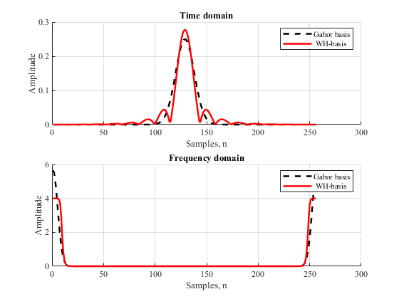

# Weyl-Heisenberg Bases Toolbox

This MATLAB toolbox was developed to study the optimal **Weyl-Heisenberg bases** and their properties in the field of signal processing and compression in time-frequency domain. The toolbox includes m-files that allow the synthesis and analysis of forming WH-functions and their corresponding orthogonal bases.  
  
The classic procedure for the synthesis of Weyl-Heisenberg bases is described in detail in this [article](https://www.researchgate.net/publication/221003716_Orthogonal_well-localized_Weyl-Heisenberg_basis_construction_and_optimization_for_multicarrier_digital_communication_systems). The fast algorithm which uses discrete **Wigner transforms** is described in [paper](https://fruct.org/publications/fruct6/files/Pet.pdf) or **Zak-transforms** in [paper](https://ieeexplore.ieee.org/document/564174).  

# Installation
Add to MATLAB path toolbox scripts and samples folders:  
```matlab  
addpath('[...] /MATLAB/Scripts')  
addpath('[...] /MATLAB/Samples')  
addpath('[...] /MATLAB/Samples/Images')  
```
Run sample script:  
```matlab
>> plotgauss3
Number of samples = 128
Standard deviation = 0.00025
```

<p align="center"></p>

# WH-function filter synthesis  
Example of the construction of frequency-time banks of Gabor (*non-orthogonal*) and Weyl-Heisenberg (*orthogonal*) filters.  
Run sample script:  
```matlab
>> filterf
Number of frequency shifts M = 16
Number of time shifts L = 16
Beta-parameter = 2
```
<p align="center"></p>

# Referencess
A full list of references is given in a separate [file](Docs/References.pdf) (**primarily in Russian**).
